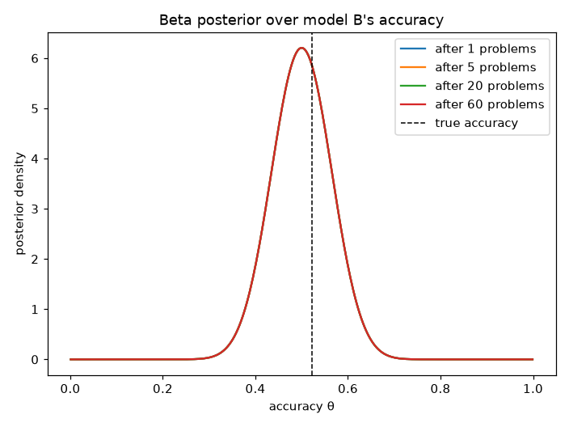
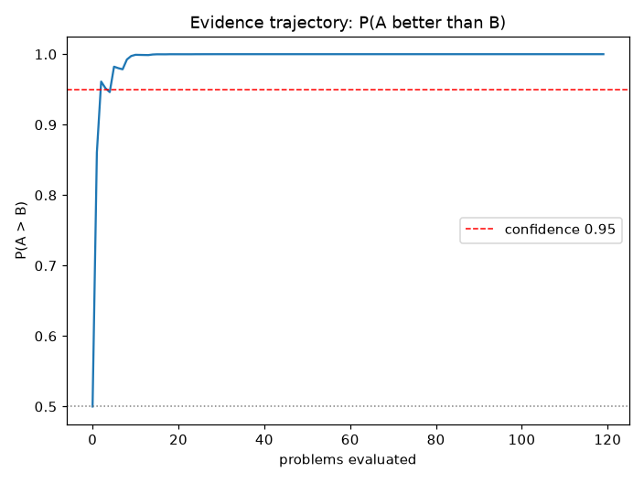

# Stop When the Evidence Is Enough
## Sequential evaluation for LLMs and agents

**BayesBench** · PyData Amsterdam 2026 / NeurIPS 2026 Education Track

Aaliyan Shaikh · Ryan Marinelli

---

<!-- _class: lead -->

# The problem

**Benchmarking is expensive.**

Every model × every example × every run.

`pip install bayesbench` — stop as soon as the posterior evidence is enough.

---

# Fixed-budget evaluation

2 models × 31,800 problems (NorEval) = **63,600 calls**

```
cost = N problems × 2 models × cost-per-call
```

Most of the budget is spent **confirming a conclusion
you already reached at example 40**.

**Question:** can we stop earlier *and* still be right?

---

# The idea: Bayesian sequential testing

```
for each problem:
    evaluate A and B
    update posterior over each model's true score
    if evidence is strong enough:
        stop
```

- **Posterior**: Beta-Bernoulli (binary), Normal-Inverse-Gamma (continuous)
- **Evidence**: P(A > B)
- **Decision**: winner / equivalent / inconclusive

---

# Posterior updating, visualized



Each example moves probability mass toward the true accuracy.

---

# The evidence trajectory



Crosses the line quickly, stays there — that's the signal.

---

# Three decisions, not two

| Status | Meaning |
|---|---|
| `winner_a` / `winner_b` | P(A>B) crossed the threshold |
| `equivalent` | posterior mass inside a **ROPE** margin |
| `inconclusive` | budget exhausted, not enough evidence |

**P(A>B) ≈ 0.5 is NOT equivalence.**
Early in a run, 50/50 usually means *not enough data*.

---

# The old defaults were dangerous

`min_samples=3, skip_threshold=0.85` — every binary comparison
**terminated at example 3**:

- 78.125% labeled "non-discriminating"
- 21.875% assigned a winner
- 0% allowed to continue

under two models that were **provably equal**.

Safe defaults: `min_samples=30`, skip heuristic off.

---

# The optional-stopping trap

Threshold rule under **equal models** (null), skip off:

| min_samples | false-winner rate |
|---|---|
| 3 | 65.8% |
| 30 | 44.1% |
| 100 | 27.5% |

P(A>B) is a random walk: **it eventually crosses any threshold.**
Raising min_samples postpones the crossing — it doesn't remove it.

---

# The fix: confidence sequences

`decision_rule="confidence_sequence"` (Waudby-Smith & Ramdas, 2023)

> **P(wrong winner at *any* stopping time) ≤ α** — by construction.

No calibration. No horizon assumptions. No order sensitivity.

| gap | any-time false rate | E[samples] |
|---|---|---|
| 0.00 | 0.0% | — |
| +0.20 | 0.0% | 185 |
| +0.40 | 0.0% | 55 |

**Guarantees cost samples; heuristics cost trust.**

---

# Order sensitivity is real

3 easy problems at the front of a 103-problem dataset:

- old rule: `winner_a` after **3 problems**
- true accuracy: A = 3/103, B = 100/103
- **100% wrong-winner rate**, 97% "saved"

On real NorEval data: permuting item order produces wrong winners
in up to **2.3% of runs** — despite enormous true gaps.

---

# The NorEval case study

Published: 410 / 31,800 problems, 98.7% "saving"

- Reproduction with bayesbench: **exact match**
- All 5 decisions correct — but full-corpus P(11B > 7B) = **1.000**
- Every stop landed in the **first prompt variant** of its task
- Savings are **prospective**, never evidence of reliability

Calibration is how you know which regime you're in.

---

# Honest evaluation workflow

1. **Large expected gap** → threshold rule + calibration report
2. **Public claim** → confidence-sequence rule (≤ 5% any-time)
3. **Shared items** → `paired=True` (per-item differences)
4. **Latency / cost** → `lower_is_better=True`
5. Always export the **decision trace** — every number reproducible

---

# Live, traced, honest by construction

```python
for update in bench.iter_compare(model_a, model_b, score_fn, dataset):
    print(update.trace.step, update.trace.p_a_beats_b)
```

- Models are called **lazily** — reported samples == actual calls
- Every step: scores, P(A>B), status, terminal reason
- Export: JSON / CSV traces

---

# What you'll do in the notebook

1. Fixed-budget evaluation and its cost
2. Posterior updating, visualized
3. Superiority vs equivalence vs uncertainty
4. Calibration across seeds and effect sizes
5. Live CPU-only comparison with traces
6. Exercises: confidence, margins, ordering, cost/reliability

`stop_when_the_evidence_is_enough.ipynb` + `exercises/`

---

# Key takeaways

- **Stop early when the gap is large; refuse to decide when it isn't.**
- **P(A>B) ≈ 0.5 is insufficient evidence — equivalence needs a ROPE.**
- **First-crossing rules can be gamed by order and fooled by noise.**
- **Confidence sequences give ≤ 5% false decisions at any stopping time.**
- **Report savings as prospective, next to your calibration numbers.**

---

# References

- tinyBenchmarks — *Maia Polo et al.*, ICML 2024
- MixEval — *Ni et al.*, NeurIPS 2024
- How Benchmark Prediction from Fewer Data Misses the Mark — NeurIPS 2025
- Waudby-Smith & Ramdas, *Estimating means of bounded random variables by betting*, JRSS-B 2023
- Ville (1939) — the martingale foundation

**bayesbench**: https://github.com/rymarinelli/bayesbench

---

<!-- _class: lead -->

# Thank you

Questions → bring your benchmarks.

`pip install bayesbench`
